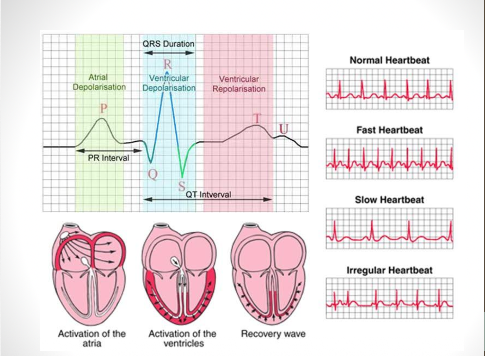

# Sensor Cardíaco HW-827

Este proyecto utiliza el módulo **HW-827** para medir y graficar la frecuencia cardíaca en tiempo real. A continuación se describe el funcionamiento del sensor, el ciclo cardíaco que da origen a la señal y los distintos tipos de pulso que el sistema busca identificar.

## 1. ¿Qué es el sensor HW-827?

El **HW-827** es un módulo sensor de pulso óptico (también conocido como *Pulse Sensor Amped*), pensado para usarse de forma **plug-and-play** con Arduino, ESP32, Raspberry Pi o cualquier microcontrolador con entrada analógica (ADC).

**Componentes principales del módulo:**

- **LED verde**: emite luz hacia la piel (dedo o lóbulo de la oreja).
- **Fotosensor APDS-9008**: detecta la cantidad de luz reflejada por el tejido.
- **Amplificador operacional MCP6001**: amplifica y filtra la señal antes de enviarla al microcontrolador.

**Características eléctricas:**

| Parámetro | Valor |
|---|---|
| Voltaje de operación | 3.0 V – 5.5 V DC |
| Corriente de consumo | ~4 mA (típico) a 5 V |
| Tipo de salida | Analógica |
| Conexión | 3 pines: VCC, GND, Señal |

### Principio de funcionamiento (fotopletismografía - PPG)

El LED verde ilumina el tejido y parte de esa luz se refleja hacia el fotosensor. Con cada latido, el volumen de sangre en los capilares cambia, lo que altera la cantidad de luz reflejada. El fotosensor convierte ese cambio en una señal eléctrica, que el amplificador acondiciona para producir una señal analógica con forma de pulso, una por cada latido del corazón.

> **Nota:** la señal del HW-827 (PPG) no es idéntica a un electrocardiograma (ECG), pero ambas son periódicas y están sincronizadas con el ciclo cardíaco, por lo que se pueden usar los mismos conceptos (frecuencia, intervalos entre picos, regularidad) para analizarlas.

## 2. El ciclo cardíaco y la señal eléctrica del corazón

La siguiente gráfica resume el ciclo eléctrico del corazón (ECG) y su relación con la actividad mecánica de aurículas y ventrículos:

### Ondas e intervalos del ECG

- **Onda P (Despolarización auricular):** representa la activación eléctrica de las aurículas, que provoca su contracción y el bombeo de sangre hacia los ventrículos.
- **Complejo QRS (Despolarización ventricular):** es el pico más alto y rápido de la señal. Marca la activación eléctrica de los ventrículos y, mecánicamente, el momento en que el corazón impulsa la sangre hacia el cuerpo. **Este pico (R) es la referencia que se usa para detectar cada latido.**
- **Onda T (Repolarización ventricular):** corresponde a la "recuperación" eléctrica de los ventrículos antes del siguiente latido.
- **Onda U:** onda pequeña y poco frecuente que aparece después de la T; su origen no está completamente definido, pero suele asociarse a la repolarización de las fibras de Purkinje.

**Intervalos importantes:**

- **Intervalo PR:** tiempo entre el inicio de la despolarización auricular y el inicio de la ventricular. Indica cuánto tarda el impulso eléctrico en viajar de las aurículas a los ventrículos.
- **Duración QRS:** tiempo que tardan los ventrículos en despolarizarse (contraerse).
- **Intervalo QT:** tiempo total desde que comienzan a despolarizarse los ventrículos hasta que terminan de repolarizarse, es decir, la duración completa de la actividad eléctrica ventricular.

### Activación mecánica del corazón

En la parte inferior de la imagen se observa la secuencia mecánica del corazón en tres etapas:

1. **Activación de las aurículas:** se contraen e impulsan la sangre hacia los ventrículos.
2. **Activación de los ventrículos:** se contraen con fuerza y expulsan la sangre hacia las arterias (este es el evento que el sensor de pulso detecta como un latido).
3. **Onda de recuperación:** el corazón se relaja y se prepara para el siguiente ciclo.

## 3. Tipos de pulso cardíaco

A partir de los picos detectados por el HW-827 (equivalentes al pico R del ECG), el sistema calcula el tiempo entre latidos consecutivos y clasifica el ritmo en cuatro categorías:

- **Pulso normal (Normal Heartbeat):** los picos se presentan a intervalos regulares y dentro de un rango de frecuencia cardíaca de reposo saludable (aproximadamente 60–100 latidos por minuto en un adulto).
- **Pulso rápido (Fast Heartbeat / Taquicardia):** los picos aparecen con mayor frecuencia, es decir, el intervalo entre latidos se reduce. Puede deberse a esfuerzo físico, estrés o condiciones médicas.
- **Pulso lento (Slow Heartbeat / Bradicardia):** los picos aparecen con menor frecuencia, con intervalos entre latidos más largos de lo normal.
- **Pulso irregular (Irregular Heartbeat / Arritmia):** los intervalos entre picos varían de forma inconsistente, sin un patrón regular, lo que indica una alteración del ritmo cardíaco.

## 4. Resumen del flujo de medición

1. El **HW-827** entrega una señal analógica que sube y baja con cada latido.
2. El microcontrolador lee esa señal de forma continua mediante su **ADC**.
3. Un algoritmo de detección de picos identifica cada latido (equivalente al pico R del ECG).
4. Se calcula el **intervalo de tiempo entre picos consecutivos** y, a partir de él, los **latidos por minuto (BPM)**.
5. Según el valor de BPM y la variabilidad entre intervalos, el sistema clasifica el ritmo como **normal, rápido, lento o irregular**.
