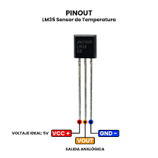

# Sensor de Temperatura LM35

Este proyecto utiliza el sensor **LM35** para medir la temperatura de forma analógica, complementando el monitoreo cardíaco con una lectura adicional de temperatura corporal o ambiental.

## 1. ¿Qué es el LM35?

El **LM35** es un sensor de temperatura de **circuito integrado** fabricado originalmente por National Semiconductor (hoy parte de Texas Instruments). Su característica principal es que entrega una **salida de voltaje linealmente proporcional a la temperatura en grados Celsius**, sin necesidad de calibración externa ni cálculos complejos para convertir la lectura.

A diferencia de un termistor o un termopar, el LM35 **no requiere fórmulas complicadas ni tablas de conversión**: basta con leer el voltaje de salida y aplicar una simple regla de tres para obtener la temperatura.



## 2. Especificaciones técnicas

| Parámetro | Valor |
|---|---|
| Rango de medición | -55 °C a +150 °C |
| Salida (sensibilidad) | 10 mV / °C |
| Precisión típica | ±0.5 °C (rango -10 °C a +85 °C) |
| Voltaje de alimentación | 4 V – 30 V DC (5 V recomendado) |
| Corriente de consumo | ~60 µA |
| Autocalentamiento | < 0.08 °C en aire estático |
| Encapsulado | TO-92 (también disponible en SOIC, TO-220) |
| Tipo de salida | Analógica |
| Calibración | Interna (no requiere ajuste externo) |

## 3. Distribución de pines

El LM35 en encapsulado **TO-92** tiene 3 pines, vistos de frente con la cara plana hacia el usuario:

| Pin | Nombre | Función |
|---|---|---|
| 1 | **VCC** | Alimentación (4 V – 30 V, normalmente 5 V) |
| 2 | **OUT** | Salida analógica de voltaje proporcional a la temperatura |
| 3 | **GND** | Tierra (masa) |

## 4. ¿Cómo funciona?

El LM35 contiene internamente un circuito basado en las propiedades térmicas de las uniones semiconductoras (similar a un diodo o transistor), cuyo voltaje varía de forma predecible con la temperatura. Ese voltaje es amplificado y linealizado internamente, de modo que en su pin de salida obtenemos:

```
Vout = 10 mV × Temperatura (°C)
```

Por ejemplo:

| Temperatura | Voltaje de salida |
|---|---|
| 0 °C | 0 mV |
| 25 °C | 250 mV |
| 100 °C | 1000 mV (1 V) |
| 150 °C | 1500 mV (1.5 V) |

Esta relación es **lineal**, por eso no se necesita ninguna tabla de conversión ni fórmula compleja: solo una multiplicación.

### Lectura con un microcontrolador (ADC)

Como el microcontrolador (Arduino, ESP32, etc.) no lee voltaje directamente sino un valor digital del ADC, el proceso es:

1. El ADC convierte el voltaje analógico en un número digital (por ejemplo, de 0 a 1023 en un Arduino UNO de 10 bits).
2. Ese número se convierte de regreso a voltaje según el voltaje de referencia del ADC.
3. El voltaje se convierte a temperatura dividiendo por la sensibilidad (10 mV/°C).

```cpp
int lectura = analogRead(A0);              // 0 - 1023
float voltaje = lectura * (5.0 / 1023.0);  // Convertir a voltios
float temperatura = voltaje * 100.0;       // 10 mV/°C → multiplicar por 100
```

> **Nota:** la fórmula `voltaje * 100.0` viene de invertir la sensibilidad: si 1 °C = 0.01 V, entonces °C = V / 0.01 = V × 100.

## 5. ¿Para qué sirve y dónde se usa?

Gracias a su bajo costo, simplicidad y buena precisión, el LM35 se usa ampliamente en:

- **Estaciones meteorológicas** y monitoreo ambiental
- **Sistemas de climatización** (HVAC) y control de temperatura
- **Incubadoras** y equipos biomédicos
- **Domótica** (automatización de ventiladores, alarmas térmicas)
- **Proyectos educativos** de electrónica y control
- **Monitoreo de temperatura corporal** en wearables y dispositivos de salud

En este proyecto, el LM35 permite registrar la temperatura junto con la frecuencia cardíaca, lo que puede ser útil para correlacionar variaciones de pulso con condiciones térmicas (por ejemplo, fiebre o esfuerzo físico).

## 6. Conexión típica con Arduino/ESP32

```
LM35          Microcontrolador
-----         -----------------
VCC    ---->  5V (o 3.3V según el micro)
OUT    ---->  Pin analógico (ej. A0)
GND    ---->  GND
```

### Código de ejemplo completo

```cpp
const int pinLM35 = A0;

void setup() {
  Serial.begin(9600);
}

void loop() {
  int lectura = analogRead(pinLM35);
  float voltaje = lectura * (5.0 / 1023.0);
  float temperatura = voltaje * 100.0;

  Serial.print("Temperatura: ");
  Serial.print(temperatura);
  Serial.println(" °C");

  delay(1000);
}
```

## 7. Recomendaciones de uso

- Si el cable entre el sensor y el microcontrolador es largo, conviene agregar un capacitor de **0.1 µF** entre VCC y GND cerca del sensor para filtrar ruido.
- Evitar tocar directamente la zona del sensor con los dedos al hacer pruebas, ya que el calor corporal puede alterar la lectura.
- Para mediciones más estables, promediar varias lecturas consecutivas del ADC antes de mostrarlas.
- Si se usa un ESP32 (ADC de 12 bits, referencia de 3.3 V), ajustar la fórmula a `voltaje = lectura * (3.3 / 4095.0)`.
